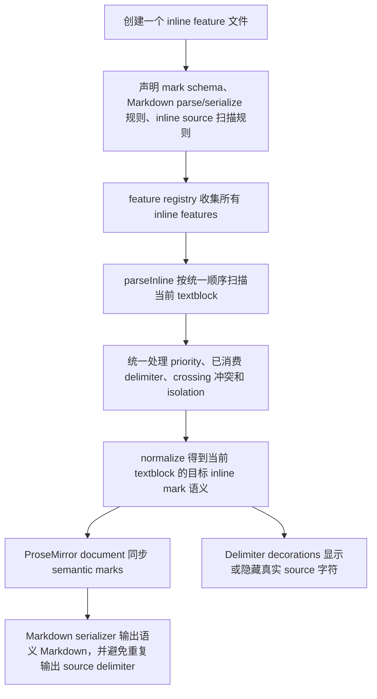

# Inline mark normalize 结构设计

## 背景

Inline mark 既是 Markdown source，也是编辑器里的语义样式。用户输入 `*text*`、`**text**`、`==text==`、`text`、`[text](url)` 这类 source 时，编辑器需要立即显示对应样式；同时 delimiter 仍然是真实文档字符，用户可以继续编辑、删除或补齐它们。

这带来一个核心问题：如果每个 inline mark 都自己处理输入、识别 source、同步 mark、隐藏 delimiter 和序列化，很快会出现多套规则。它们会在嵌套、冲突、inline code isolation、删除 delimiter、Markdown round trip 等场景里互相打架。

因此我们选择把 inline mark 的编辑态收敛到一个统一的 normalize 流程。

## 决策

Inline mark feature 只声明自己是什么，以及如何从一段文本中识别自己的 source。所有 feature 的识别结果必须进入同一个 `parseInline` 流程，由它统一裁决；随后由 normalize 根据裁决结果同步 ProseMirror semantic marks，并派生 delimiter 的显示状态。

稳定流程如下：

这个流程的关键设计决定是：

- Source text 是 inline mark 编辑态的事实来源。
- `parseInline` 是所有 inline source 的唯一裁判入口。
- Normalize 负责把 source 识别结果同步成 semantic marks。
- Decorations 只负责显示真实字符，不负责判断 source 是否成立。
- Markdown serialization 只读取文档语义和 source projection，不触发编辑态转换。

## 创建一个 feature

新增 inline mark 时，应该创建独立的 feature 文件。这个文件描述该 feature 的完整能力，但不拥有全局编辑流程。

一个 inline mark feature 通常提供四类信息：

- 它在 ProseMirror 中对应什么 semantic mark。
- Markdown parser 如何把外部 Markdown 读成这个 semantic mark。
- Markdown serializer 如何把这个 semantic mark 写回 Markdown。
- 编辑时如何从当前 textblock 的 source text 中识别这个 mark 的 source。

例如 highlight feature 关心的是 `==text==` 如何成立、成立后内容对应 highlight mark、输出时如何写回 `==` delimiter。它不应该自己决定是否要覆盖 italic、是否要隐藏 delimiter、是否要清理其它 mark。这些跨 feature 的判断属于统一 normalize 流程。

## 注册与收集

所有 feature 进入统一 registry。编辑器启动时从 registry 收集：

- schema marks；
- Markdown-it parser 插件和 token handler；
- Markdown serializer 的 delimiter 规则；
- inline source 扫描规则；
- feature 自己额外需要的插件或 keymap。

Inline normalize 只消费 registry 里的 inline source 扫描规则。这样新增 feature 后，它自然进入同一套 parse/normalize/decorate/serialize 管线，而不是额外挂一条旁路。

## parseInline 的职责

`parseInline` 接收当前 textblock 的文本和上下文，然后依次询问各 inline feature：“你能在这里识别出哪些 source？”

它做三件不会随具体 mark 改变的事：

- 按统一优先级组织扫描顺序。
- 记录哪些 delimiter 已被更高优先级 source 使用，避免同一段 source 被多个 feature 重复消费。
- 拒绝 crossing 结构，只允许互不相交或合法包含的 inline source。

这意味着具体 feature 只描述自己的局部语法；全局冲突由 `parseInline` 决定。比如 inline code 内部不应再解析 emphasis，strong 与 italic 的同字符 family 不能互相抢 delimiter，highlight 和 emphasis 的交叉结构不能各自成立一半。

`parseInline` 的输出不是最终文档状态，而是一份“这段 textblock 现在应该有哪些 inline mark 语义、哪些 source delimiter 属于这些语义”的解析结果。

## normalize 的职责

Normalize 消费 `parseInline` 的结果，并把文档里的 semantic marks 调整到目标状态。

它的原则是：

- 如果 source 完整成立，内容区间应该带上对应 semantic mark。
- 如果 source 被破坏，原先由该 source 推导出的 semantic mark 应该消失。
- 如果用户补齐 source，semantic mark 应该重新出现。
- 同一个 textblock 里的 inline marks 由同一轮 normalize 统一同步，避免 feature 之间各自改文档。

Normalize 不负责解释用户刚刚按了哪个键，也不维护一份独立的“live mark 状态”。它只看当前文档文本、当前 marks 和统一 parse 结果，推导文档应该变成什么语义状态。

这让删除、粘贴、程序化替换、撤销重做和普通输入走同一条路径：文档先变，normalize 再从当前事实重新收敛。

## delimiter 显示

Delimiter 是真实文档字符，不是 widget，也不是隐藏状态里的虚构文本。

Normalize 的解析结果会告诉显示层哪些字符是 source delimiter。Decoration 根据光标位置和 feature 给出的显示意图，把这些真实字符显示为 pending marker 或隐藏起来。

Decoration 的职责边界很重要：

- 它可以改变 delimiter 的视觉呈现。
- 它不能创建不存在的 delimiter。
- 它不能自己判断一段 source 是否成立。
- 它不能替代 semantic mark。

因此，用户看到的 pending marker 只是 source text 的一种显示方式；真正的编辑事实仍然在文档文本和 semantic marks 里。

## Markdown parse 与 serialize

Markdown parse 负责把外部 Markdown 读成 ProseMirror semantic marks。进入编辑器后的 live source 识别仍由 `parseInline` 和 normalize 负责。

Markdown serialize 负责把当前文档语义写回 Markdown。这里有一个重要约束：source projection 中 delimiter 已经是真实文本，serializer 不能再因为内容带有 semantic mark 就额外套一层 delimiter。

所以 serializer 必须能识别两种等价形态：

- committed 形态：文档只有内容和 semantic mark，输出时合成 delimiter。
- source projection 形态：文档里已有真实 delimiter，内容带 semantic mark，输出时复用这些 delimiter。

这保证 `*x*` 在编辑态和 committed 态都序列化为同一份 Markdown，而不会变成重复 delimiter 或 escaped source。

## 设计边界

这个 ADR 记录的是最稳定的结构决定，而不是某个实现版本的类型和函数细节。

可以变化的部分：

- 具体扫描算法；
- priority 的数值或排序；
- normalize 内部如何比较 mark 分布；
- delimiter decoration 的 class 名；
- serializer 识别 source projection 的具体实现；
- 未来是否把扁平解析结果升级为 source layer tree。

不应该变化的部分：

- 新 inline mark 通过 feature 文件声明能力。
- 所有 inline source 进入统一 registry。
- `parseInline` 统一裁决 source 成立、冲突和隔离。
- Normalize 统一把 source 结果同步为 semantic marks。
- Decoration 只显示真实 delimiter，不判断语义。
- Serializer 负责让 committed 和 source projection 输出同一 Markdown 语义。

## 后果

这个设计让新增 inline mark 的路径变得稳定：实现 feature，注册到 registry，交给统一 parse/normalize 流程处理。

它也把复杂性集中在正确的位置。单个 feature 不需要知道所有其它 feature 的行为；跨 feature 的冲突、嵌套和隔离由统一入口处理。显示层不需要理解 Markdown 语法；它只消费 normalize 的结果。Markdown IO 不参与编辑态转换；它只负责外部文本格式和内部语义之间的往返。

代价是 normalize 成为 inline mark 的架构中心。任何绕过它的 feature 都会制造第二套语义来源，后续在嵌套、删除和序列化场景中变得不可预测。因此后续扩展应该增强这个中心，而不是新增旁路。
