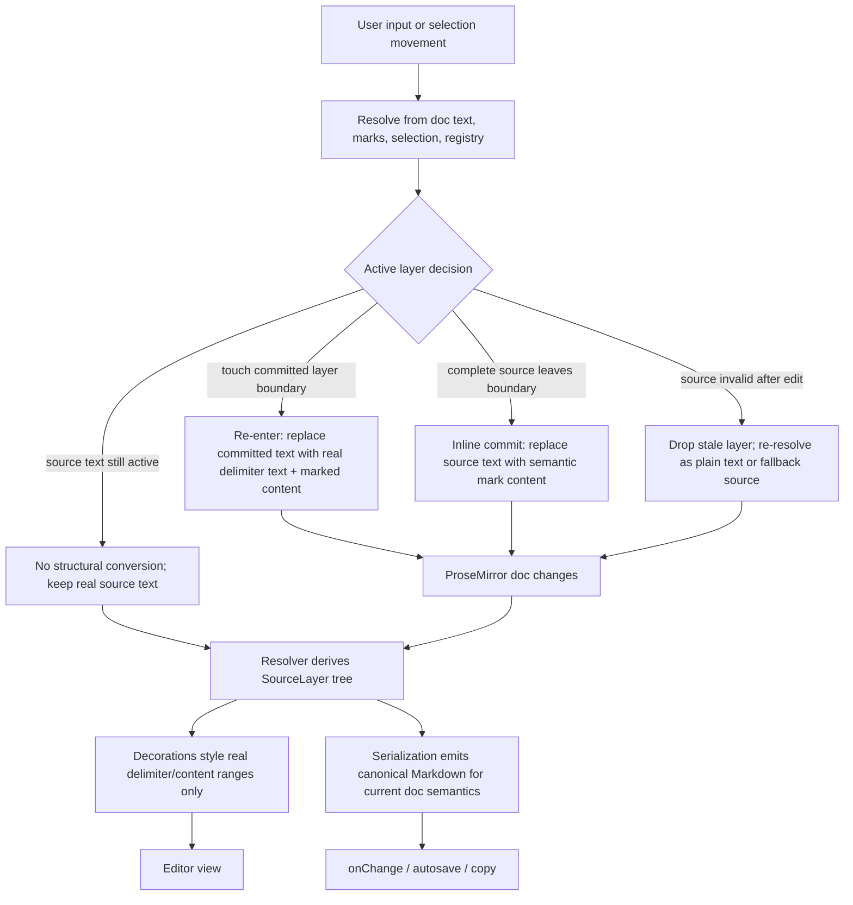

# Live inline mark 抽成统一深模块

Live inline mark 的 source detection、Source projection、Inline commit、Re-enter、priority 和组合规则统一收敛到一个深模块中。各具体 mark 只声明 delimiter、mark name、样式和优先级，不再各自维护边界行为。

## 决策

### Live inline mark 只有两种状态

Live inline mark 只有 Committed 和 Source projection 两种状态，delimiter 不存在第三种视觉态。Decoration 可以用于给真实 doc text 加样式，但不能用 widget 创建看起来像 delimiter 的字符。

Committed 状态下，ProseMirror doc 中只有内容 text 和 semantic mark，Markdown delimiter 不在 doc 中，也不显示。例如 `==1==` commit 后，doc 表示为带 highlight mark 的 `1`。

Source projection 状态下，Markdown delimiter 作为真实可编辑字符写入 ProseMirror doc，内容仍按对应 Inline mark 样式显示。例如重新进入 highlight 后，doc 表示为真实的 `==` delimiter text 加带 highlight mark 的 `1`。用户看到的 delimiter 必须可以像普通字符一样被光标经过、选中、删除和替换。

这两种状态是用户可见和文档语义上的完整状态集合。实现内部可以维护或派生 `SourceLayer` / `ResolvedInlineSourceState` 这类 resolver 结果，用来描述当前 transaction 或 render pass 中的 source layer tree、active layer 和待转换 layer；但这些 resolver 结果不是第三种用户状态，也不是 delimiter 的另一种表示。它们必须能从当前 doc text、marks、selection 和 live mark registry 重新计算出来。

进入或离开 Source projection 会改变真实 ProseMirror doc text，因此属于用户内容变更，应进入用户历史并触发对外内容变更通知。Source projection 内的输入、删除和替换同样是用户内容变更。由这些用户动作触发的自动 Inline commit 也是一次真实 doc 转换，但它应保持与触发动作一致的用户意图，避免在 undo/redo 中产生难以理解的额外中间步。

同一个 Live inline mark layer 在任一时刻只能有一种表示。若某一层已进入 Source projection，则该层 delimiter 是真实 doc text，该层 mark 必须从这段 source text 上移除，且同层不能再用 boundary widget 或其他 doc 外机制投影 delimiter。未展开的外层或内层可以继续保持 Committed，或按各自 layer 的 Source projection 规则单独展开。

### 当前处理机制

机制上，doc text、marks、selection 和 live mark registry 是事实来源。Resolver 每轮从事实来源派生 SourceLayer tree；controller 根据 resolver 结果执行 Re-enter、Inline commit 或保持当前 Source projection；decorations 只给真实字符加样式，不创建 delimiter 字符。

### Source projection 逐层展开

组合 Live inline mark 不一次性展开整个 source。光标先触达外层 mark 时只展开外层 Source projection；继续移动触达内层 committed Live inline mark 边界时，内层再展开。

当光标位于外层 Source projection 内、但相邻内层 Live inline mark 仍处于 committed 状态时，输入普通字符归属外层 source layer，不自动继承内层 committed mark。

例如 `*==1==*` 在 Committed 状态下，doc 中是同时带 italic 和 highlight mark 的 `1`。光标先触达外层 italic 边界时，只展开 italic delimiter；继续移动到内层 highlight 边界时，再展开 highlight delimiter。每一层展开后，该层 delimiter 都是真实 doc text，方向键按真实字符逐个移动。

### Inline commit boundary 统一处理

当一个 Live inline mark 处于 Source projection 且 source 已完整、非空时：

- 输入非当前 closing delimiter 的普通字符：先 Inline commit 当前 source layer，再把该字符插入到当前 source layer 外侧；若当前 source layer 位于外层 Source projection 内，该字符仍留在外层 source layer 上下文中。
- 输入当前 closing delimiter 字符：不提前 commit，继续交给 Inline mark 解析。
- 光标移出当前 source layer：Inline commit 当前 source layer。
- 光标进入内层 committed Live inline mark 边界：只展开内层 Source projection，不提交外层 source layer。

### Re-enter 由 selection 驱动

Re-enter 不绑定到某个 keymap。方向键、鼠标点击、Shift 选区和程序化 selection 都应根据 selection 所在位置触发相同的逐层 Source projection 语义。

Re-enter 的实现结果必须是一次 Source projection transaction：把目标 layer 从 Committed 转成带真实 delimiter text 的 source。它不能只画 boundary widget，也不能让用户看到不可选、不可删、不可逐字符经过的伪 delimiter。

### Resolver 统一处理冲突和组合

Live inline mark module 内部需要统一的 inline source resolver。resolver 从当前 doc text、marks、selection 和 live mark registry 派生当前的 `SourceLayer` tree 和 committed layer candidates；它负责识别 source ranges、处理 delimiter priority、Delimiter fallback、Crossing inline mark 和嵌套组合。

Decorations、Re-enter、Inline commit 和 serialization 不应各自用局部 regex 或 keymap 状态猜测当前 pending/source 阶段，而应消费同一份 resolver 结果。这样多层嵌套时，系统有单点判断：哪些 layer 已经是 Source projection，哪些 layer 仍是 Committed，当前 selection 应该展开哪一层，当前完整 source 应该提交哪一层，以及哪些真实字符应该获得 pending/live class。

Resolver 结果可以被缓存到 plugin state 中以避免重复计算，但缓存只能是派生数据。它不能成为文档语义的唯一来源，也不能在 doc text、marks 或 selection 变化后继续强行维持已经失效的 source layer。若用户删除 delimiter 或破坏 source 结构，下一次 resolver 结果必须反映新的文本事实：该 source layer 失效、降级为普通文本，或按 priority/fallback 规则重新识别为其他 layer。

同 family 长 delimiter 已成立时，长 delimiter 优先：`**1**` 是 strong，`~~1~~` 是 strikethrough。长 delimiter 无法形成完整非空 source 时，允许短 delimiter fallback：`**1*` 可形成 italic，`~~1~` 可形成 subscript。

不同 delimiter family 的嵌套组合允许同时生效。Crossing inline mark 只保留优先级更高的 Live inline mark，另一个保持普通文本。

### Priority 规则

Inline mark priority 用于解决 Crossing inline mark 和同位置 delimiter 竞争：

1. inline code
2. strong / strikethrough
3. highlight
4. italic / subscript / superscript

优先级相同时，source 更长者优先；仍相同时，起点更靠左者优先；仍相同时，按 registry 顺序稳定排序。

### Inline code 是隔离区

inline code 自身属于 Live inline mark，参与逐层 Source projection、Inline commit 和 Re-enter。但 inline code 内容是 Inline mark 解析隔离区：内容保持 literal，不解析 italic、strong、strikethrough、highlight、subscript 或 superscript；外部 Live inline mark 也不能使用 inline code 内的 delimiter 作为 closing delimiter。

### Markdown serialization 跟随真实文档语义

Source projection 和 Committed 表示同一 Markdown 语义时，serialization 应输出同一 canonical Markdown。例如 committed highlight 和展开后的 highlight source 都输出 `==1==`。这保证 UI 内部可以在两态之间转换，而 copy、autosave 和 `getMarkdown()` 仍能得到稳定 Markdown。

进入或离开 Source projection 是真实 doc 变更，应作为用户内容变更对外通知；只是当两态的 canonical Markdown 相同时，外部消费者可能观察到一次内容变更通知但 Markdown 字符串不变。Source projection 内的选区替换、输入或删除按普通 Markdown source 编辑，并按当前 source text 重新序列化。

组合 mark serialization 按稳定顺序输出，避免相同语义在多种 Markdown source 之间抖动。初始规则按 registry / priority 的稳定顺序选择外层 mark。

现有 Markdown parse / serialize round trip 是硬约束。重构后，已有 italic、strong、inline code、strikethrough、highlight、subscript 和 superscript 的 Markdown 语义不能回退或漂移。

### 一次迁移现有 Live inline mark

italic、strong、inline code、strikethrough、highlight、subscript 和 superscript 都迁到同一个 `createLiveInlineMarkFeature(spec)` 风格接口。具体 feature 文件只保留声明式 spec 和必要的 Markdown parse / serialize 声明，不继续暴露 per-mark keymap、plugin helper 或边界补丁。

迁移分两步推进：先做等价迁移，把现有 Live inline mark 行为搬到新 module；再逐步打开新语义，包括 selection-driven Re-enter、逐层 Source projection、Delimiter fallback、Crossing inline mark priority 和组合 mark 行为。

### 迁移计划

迁移按小 slice 推进，每轮用 specs 先覆盖一个用户可见 checkpoint，再实现对应行为。按键触发型行为遵循红绿重构流程，测试落点为 `packages/editor/src/specs/features/*.cases.ts`，并通过 `packages/editor/src/specs/index.ts` 的显式 registry 汇总。

1. 收敛现有入口：保留现有行为，把 italic、strong、inline code、strikethrough、highlight、subscript 和 superscript 接到统一 live inline mark controller。各 feature 文件只保留声明式 spec 和 Markdown parse / serialize 相关声明。
2. 删除 boundary delimiter widget 路线：任何 delimiter reveal 都必须通过 Source projection transaction 写入真实 doc text。Decorations 只允许给真实 doc text 加 pending/live class。
3. 引入 resolver 产物：定义 `SourceLayer` / `ResolvedInlineSourceState`，由 doc text、marks、selection 和 registry 派生 source layer tree、committed candidates、active layer、待 re-enter layer 和待 commit layer。先让 decorations 消费 resolver 结果，避免每个 config 自己扫全文并互相叠加。
4. 迁移 Re-enter：把 ArrowLeft/Backspace 局部逻辑迁到 selection-driven controller。方向键、鼠标点击、Shift 选区和程序化 selection 都通过 resolver 判断是否需要逐层展开 Source projection。
5. 迁移 Inline commit boundary：commit 由 resolver 判断当前 source layer 是否完整、非空、是否被 selection 移出或被普通输入越过。输入当前 closing delimiter 字符时不提前 commit。
6. 打开嵌套和冲突规则：逐步实现同 family delimiter fallback、不同 family 嵌套组合、Crossing inline mark priority、inline code isolation。每条规则用独立 spec checkpoint 锁住。
7. 收敛 serialization 和外部变更语义：确保 Source projection 和 Committed 表示同一语义时输出稳定 canonical Markdown；Source projection transaction 作为真实用户内容变更进入 history、onChange、autosave 和未来远程同步。

## 原因

现有实现把 Live inline mark 行为分散在 per-mark regex、decoration widget、keymap 和局部补丁中。delimiter 有时是真实 doc 字符，有时是 widget；这让多字符 delimiter、输入继承、Backspace、鼠标点击、选区、组合 mark 和冲突规则不断产生边界 bug。

把 Live inline mark 抽成深模块，可以把复杂性集中在一个 seam：resolver 决定当前 source 语义，controller 负责 Source projection / Inline commit / Re-enter 状态转换。具体 feature 文件只声明自己是什么 mark。

## 后果

- 当前 `liveInlineMark` 的 interface 要从若干 helper 函数升级为声明式 spec，返回 plugin、keymap 和 serialization helpers。
- Boundary delimiter widget 路线需要迁出或删除；delimiter reveal 统一通过 Source projection transaction 写入真实 doc text。
- 需要引入统一 resolver 产物作为内部派生状态；它可以缓存，但必须由 doc text、marks、selection 和 registry 决定，不能成为第三种持久 pending 状态。
- Source projection transaction 是用户内容变更；实现仍可用 editor-internal meta 标注转换原因，但不能把它当成对 history、onChange、autosave 或未来远程同步不可见的纯视图更新。
- Specs 要从单 mark case 扩展到共享 live inline mark 行为：逐层 Re-enter、Source projection 内编辑、Delimiter fallback、priority、Crossing inline mark、inline code isolation 和组合 mark。
- 现有 mark feature 文件会被改薄；短期迁移范围较大，但换来边界行为 locality。
- 如果未来引入 collab 或远程同步，Source projection transaction 需要作为真实内容变更发送和合并；实现可以用 meta 标注原因，但不能简单过滤掉。
