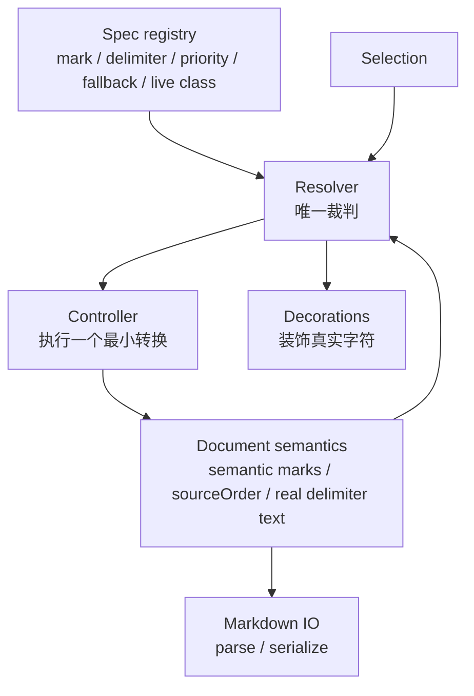
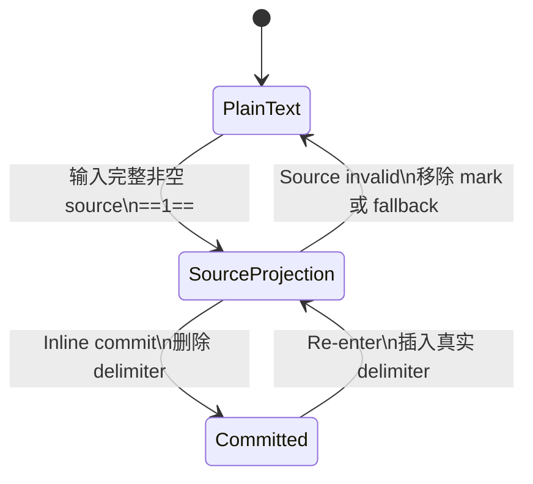
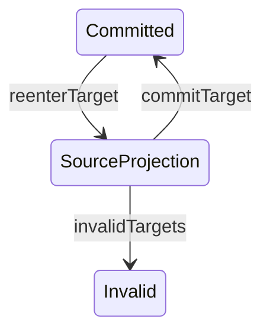
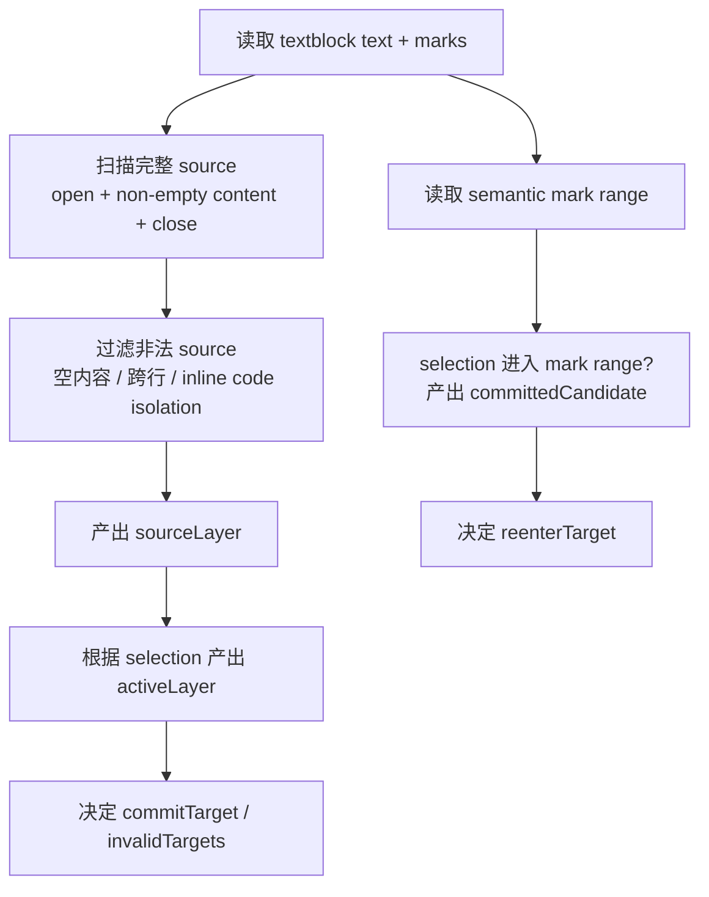
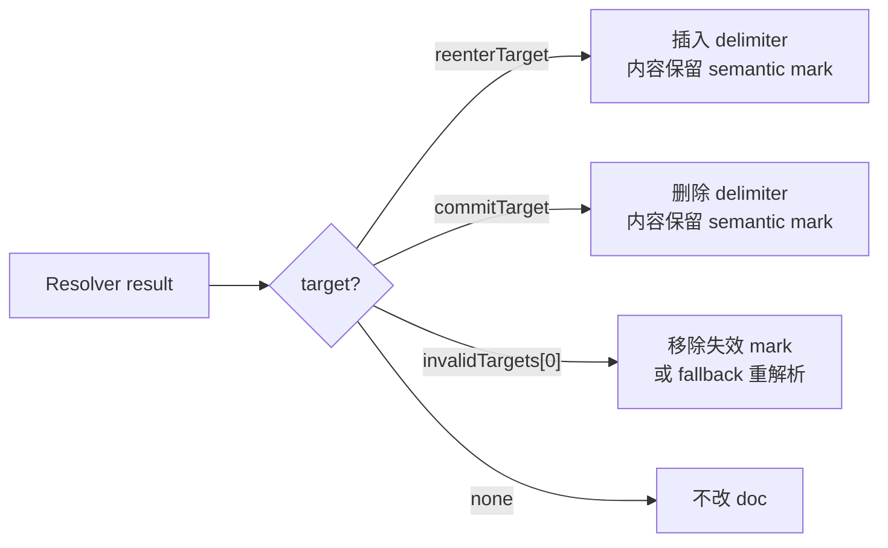
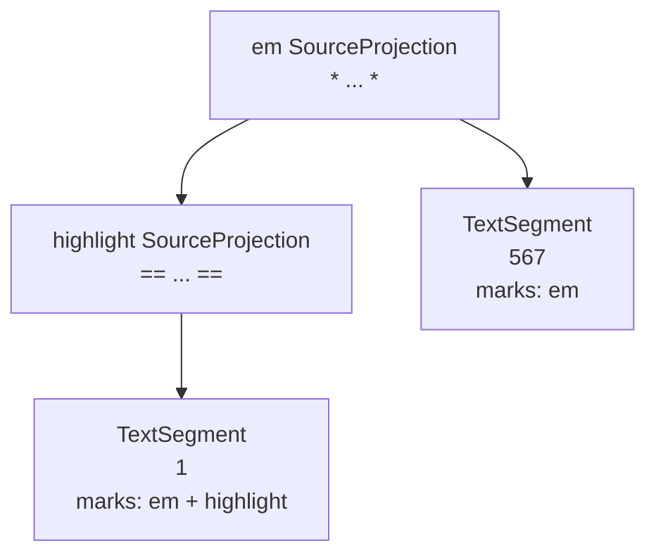
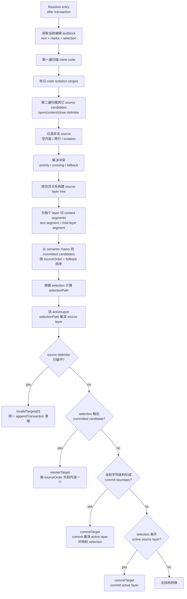

# Live inline mark 模块设计

Live inline mark 的 Source projection、Inline commit、Re-enter、嵌套、priority、fallback、inline code isolation 和 Markdown serialization 由统一模块处理。具体 mark 只声明 delimiter、mark name、样式和优先级。

## 用户模型与当前问题

Live inline mark 应提供 Typora 式行内 Markdown 编辑体验：

- 用户输入完整 inline source，例如 `*text*`、`**text**`、`text`、`==text==` 后，内容立即显示为对应 semantic mark 样式。
- Commit 后 delimiter 从文档可见内容中隐藏，只保留 semantic mark；光标重新进入该 mark 范围时，delimiter 作为真实可编辑字符重新出现。
- Source projection 中的 delimiter 是真实 doc text，不是 widget 或 fake source；用户可以直接编辑、删除或替换 delimiter 和内容。
- 嵌套 inline mark 按 source layer 逐层展开和提交，例如 `*==text==*` 可以先展开外层 italic，再展开内层 highlight。
- Inline code 内容是 isolation range；其中的字符保持 literal，不参与其它 inline mark 解析，外部 mark 也不能使用 code 内容里的 delimiter 作为 closing delimiter。
- Priority、delimiter fallback、crossing 冲突和 Markdown parse / serialize 都应遵循同一套 source 识别结果。

当前实现的问题是职责分散，导致同一个 source 状态被多个局部逻辑重复判断：

- `handleTextInput`、keymap、`appendTransaction`、decorations 和 Markdown serialization 分别处理 source 识别、commit、re-enter、pending marker 和输出修正。
- Committed 与 Source projection 的转换入口不统一，键盘输入、方向键、点击和程序化 selection 容易得到不同结果。
- Decorations 仍可能承担 source 判断或 fake delimiter 展示，和"delimiter 是真实可编辑字符"的用户模型冲突。
- 嵌套 inline mark 只靠扁平 range、mark rank 或局部正则难以表达 `*==text==567*` 这种外层 source 内同时包含子 source layer 和普通 text segment 的结构。
- Inline code isolation、priority、fallback 和 crossing 规则缺少统一裁判，不同功能可能对同一段 source 得出不同语义。
- Markdown parse / serialize 缺少 sourceOrder 语义，无法稳定保留 `*==text==*` 与 `==*text*==` 的用户输入顺序。

因此需要把 live inline mark 收敛成一个统一模块：Resolver 负责判断 source 状态和本轮目标，Controller 只执行 Resolver 选出的最小转换，Decorations 只装饰 Resolver 识别出的真实字符，Markdown IO 只读写 semantic marks 和 sourceOrder。

本文按实现顺序分两步：

1. 单 inline mark：先跑通一个不嵌套的 mark，并建立 resolver、controller、decorations、Markdown IO 的职责边界。
2. 嵌套 inline mark：在同一套模块上扩展 source layer tree、sourceOrder、逐层 re-enter / commit、priority 和 fallback。

## 模块边界

实现不应让 keymap、decorations、serialization 各自判断 source 状态。所有判断集中在 Resolver，其他部分只消费 Resolver 或文档语义。



依赖方向：

- `Spec registry` 和 `Document semantics` 是输入。
- `Resolver` 只读 doc、selection、registry，产出派生状态和本轮 target。
- `Controller` 只执行 Resolver 选出的一个 target，不自己解析 Markdown。
- `Decorations` 只消费 `sourceLayers`，不决定 source 是否成立。
- `Markdown IO` 读取 semantic marks 和 `sourceOrder`，不改变编辑态。

处理范围：

- Live inline mark Resolver 是编辑时机制，只处理当前正在编辑的 textblock。
- 初始加载走 Markdown parse，直接生成 committed semantic marks 和 `sourceOrder`，不需要进入 Source projection，也不需要全文运行 Resolver。
- `getMarkdown()`、复制和 autosave 走 Markdown serialization，读取文档语义输出 Markdown，不触发 Resolver。
- Inline mark 不跨 textblock。输入、删除、选区移动、re-enter、commit 和 invalidation 都只需要 resolve 当前 selection 所在 textblock。
- 若一次 transaction 改动多个 textblock，例如粘贴或多段替换，Controller 仍按 selection 所在 textblock 选择本轮 target；其他 textblock 只通过 Markdown parse 或后续编辑进入 committed 语义，不做全文 live projection。

Transaction 时序：

- 普通文本输入默认交给 ProseMirror。Live inline mark 不通过 `handleTextInput` 抢普通字符，也不把用户输入预先改写成"先 commit 再插入"。
- Resolver 的事实来源是 transaction 后的当前 doc text、marks、selection 和 registry。完整 source 后输入普通字符、Space 或当前 delimiter 字符，都先成为真实 doc text，再由 Resolver 从当前字符结构推导是否要 commit、保持 source、fallback 或 invalid。
- Re-enter、selection leave commit、boundary commit、fallback 和 invalidation 都在 transaction 后由 Resolver / Controller 处理。Controller 可以基于 Resolver 识别出的 `sourceLayer` 删除 delimiter，并按 ProseMirror mapping 把 selection 映射到删除 delimiter 后的位置。
- `handleTextInput` / input context 不是当前设计的核心入口。若未来遇到 IME composition、多字符 replacement、远程协作或其它无法从当前 doc 可靠还原用户意图的边界场景，可以再引入可选 input hint；它只能作为本轮 resolver 的辅助线索，不能成为状态、不能驱动 decorations、也不能绕过"当前 doc 是事实来源"的原则。
- 普通 Space 输入默认保持普通空格；当 Space 作为完整 live inline mark source 后的 boundary commit 字符时，Controller 将该边界空格规范化为 NBSP，避免 Markdown serialization 将它吞进 mark whitespace 规则。

同一个 live inline mark layer 在任一时刻只有两种用户可见状态：

- `Committed`：内容有 semantic mark，delimiter 不在 doc 中。
- `Source projection`：delimiter 是真实 doc text，内容仍有 semantic mark。

`Re-enter` 和 `Inline commit` 只增删 delimiter，不移除内容 text 上的 semantic mark。只有 delimiter 结构被用户破坏、Resolver 判断 source 不再成立时，才移除对应 semantic mark 或 fallback 重解析。Source projection 内容仍应保留 semantic mark；decorations 只是给真实 delimiter 或尚未写入 mark 的 live 内容补充显示样式，不能替代语义。

Decorations 只能装饰真实字符，例如把真实 delimiter 标成 pending 样式，或把内容 range 标成 live 样式。不能用 widget 或 doc 外机制画 fake delimiter。

Live inline mark 的 semantic mark 应使用非 inclusive 边界。`|1[em]` 和 `1[em]|` 算作 selection 触达 committed mark 边界，可以产生 `committedCandidate`；但在这些边界直接输入普通字符时，新字符默认落在 mark 外侧。

## 1. 单 inline mark

先只考虑一个不嵌套的 mark，例如 highlight：

```markdown
==1==
```

用户输入完整 source 后，编辑器识别出 highlight。此时同一 Markdown 语义有两种表示：

```text
Source projection:
  "==" delimiter
  "1" [highlight]
  "==" delimiter

Committed:
  "1" [highlight]
```

单层状态转换：



### 单层 Resolver

单层 Resolver 每次从当前 doc 和 selection 重新推导状态。它不保存真状态，也不改文档。

Resolver 输出分两类：

- 当前事实：`sourceLayers`、`committedCandidates`、`selectionPath`、`activeLayer`。
- 本轮动作目标：`reenterTarget`、`commitTarget`、`invalidTargets`。

这两类不能混成状态。Layer 的生命周期仍然只有 `Committed`、`Source projection`、`Invalid`。`sourceLayers` 表示"当前 doc 里已经处于 Source projection 的层"；`reenterTarget` 表示"当前还是 Committed，但 selection 进入后本轮应该展开的层"。



例如 selection 进入 committed highlight 的那一帧：

```text
doc:
  "1" [highlight]

resolver:
  sourceLayers = []
  reenterTarget = highlight
```

Controller 执行 re-enter 后，下一帧才会变成：

```text
doc:
  ==1==

resolver:
  sourceLayers = [highlight]
  reenterTarget = null
```



Committed 边界判定：

```text
|1[em]   left-boundary  -> committedCandidate
1[em]|   right-boundary -> committedCandidate
1|[em]   inside         -> committedCandidate
```

这些边界只用于 selection-driven re-enter。若同一 transaction 是普通 text input，输入先落入 doc；Resolver 不把这次输入改写成"先 re-enter 再插入"。

推荐的单层数据结构：

```ts
interface ResolvedInlineSourceState {
  // 当前事实
  sourceLayers: SourceLayer[];
  committedCandidates: CommittedLayer[];
  selectionPath: SelectionPath;
  activeLayer: SourceLayer | null;

  // 本轮动作目标
  reenterTarget: CommittedLayer | null;
  commitTarget: SourceLayer | null;
  invalidTargets: InvalidSourceLayer[];
}

interface SourceLayer {
  id: string;
  config: LiveInlineMarkConfig;
  parentId: null;
  depth: 0;

  from: number;
  to: number;
  openFrom: number;
  openTo: number;
  innerFrom: number;
  innerTo: number;
  closeFrom: number;
  closeTo: number;

  sourceOrder: number | null;
  segments: TextSegment[];
}

interface TextSegment {
  kind: "text";
  from: number;
  to: number;
  text: string;
  marks: readonly Mark[];
}

interface CommittedLayer {
  id: string;
  config: LiveInlineMarkConfig;
  from: number;
  to: number;
  sourceOrder: number | null;
  marks: readonly Mark[];
  touch: "left-boundary" | "inside" | "right-boundary";
}

interface InvalidSourceLayer {
  layer: SourceLayer;
  reason:
    | "missing-open-delimiter"
    | "missing-close-delimiter"
    | "empty-content"
    | "cross-line"
    | "code-isolation"
    | "conflict";
}

interface SelectionPath {
  pos: number;
  containingLayers: SourceLayer[];
  nearestTextSegment: TextSegment | null;
  boundary: "outside" | "open-delimiter" | "content" | "close-delimiter";
}
```

单层示例：

```text
doc:
  ==1==

sourceLayer:
  mark: highlight
  open:  [from, innerFrom)  -> "=="
  inner: [innerFrom, innerTo) -> "1"
  close: [innerTo, to) -> "=="
  segments:
    text "1" [highlight]
```

处于 `sourceLayers` 时，selection 不固定在某一个位置。Resolver 需要另外用 `selectionPath` 和 `activeLayer` 描述 selection 与 source layer 的关系：

```text
|==1==   outside / before
=|=1==   open-delimiter
==|1==   content boundary
==1|==   content boundary
==1=|=   close-delimiter
==1==|   outside / after
```

如果 selection 仍在这层内部或边界上，`activeLayer = highlight`。如果 selection 已离开这层，Resolver 可以产出 `commitTarget = highlight`。

Resolver 的目标选择规则：

- 若 selection 进入 committed mark 范围或边界，产出 `reenterTarget`。
- 若 selection 位于完整 source projection 内，产出 `activeLayer`。
- 若当前 doc 中完整 source projection 后已经出现普通 trailing text 或 Space，Resolver 从当前字符结构产出 `commitTarget`；Controller 删除 source delimiter，保留 trailing text，并把 selection 映射到 trailing text 后。
- 若完整 source projection 后紧跟当前 delimiter 字符，例如 `*1**`，Resolver 不提前 commit 短 delimiter source；这次输入保持为普通 source edit，等待下一轮解析是否形成更长 delimiter、fallback 或普通文本。
- 若 selection 紧邻当前 active layer 的 close delimiter，且当前 doc 结构已经形成该 layer 的完整 source，最深 active layer 优先成为 `commitTarget`；其他位置的同字符输入按普通 source edit 处理。
- 若 selection 离开 source projection，产出 `commitTarget`。
- 若 delimiter 结构被破坏，立即在同一 appendTransaction 产出并清理 `invalidTargets`，避免出现一帧"delimiter 已坏但内容仍保持 live 样式"。

Controller 每轮只消费一个 target：



### 单层 Controller

Re-enter：

```text
Committed:
  "1" [highlight]

selection 进入 highlight 后:
  "==" delimiter
  "1" [highlight]
  "==" delimiter
```

Inline commit：

```text
Source projection:
  "==" delimiter
  "1" [highlight]
  "==" delimiter

Committed:
  "1" [highlight]
```

结束边界继续输入普通字符时，新字符插在当前 mark 后面：

```text
*1*| 输入 x:
  当前 doc 先变成 "*1*x|"
  Resolver 识别 "*1*" 为 sourceLayer，"x" 为 trailing text
  Controller 删除 delimiter，映射 selection

结果:
  "1" [em]
  "x" []

Markdown 语义:
  *1*x
```

### 单层 Decorations

Decorations 只消费 Resolver 的 `sourceLayers`：

```text
[openFrom, openTo)     -> md-pending
[innerFrom, innerTo)   -> liveClass（仅当内容尚未带 semantic mark 时）
[closeFrom, closeTo)   -> md-pending
```

未被 Resolver 识别出的字符保持普通文本。例如 `==1=` 不是完整 highlight source，不能显示 pending marker，也不能给 `1` 加 highlight live 样式。

### 单层 Markdown IO

Source projection 和 Committed 表示同一 Markdown 语义时，serialization 输出一致：

```text
Committed:
  "1" [highlight]

Source projection:
  "==" delimiter
  "1" [highlight]
  "==" delimiter

Both serialize to:
  ==1==
```

Parse 写入 semantic mark。Serialize 优先读取 semantic mark；若 mark 有 `sourceOrder`，保留它；若没有，在单层场景中按 spec delimiter 输出。

当 Source projection 的真实 delimiter 已经在 doc 中包住 semantic mark 内容时，serializer 必须识别这一形态并避免重复输出 mark delimiter。例如 doc 是 `"*" + "1"[em] + "*"` 时，输出应为 `*1*`，不能输出 `**1**` 或 escaped delimiter。这个消重属于 Markdown IO，不应交给后置 regex 猜测。

## 2. 嵌套 inline mark

嵌套不会引入第三种状态。它只是多层 live inline mark 各自处于 `Committed` 或 `Source projection`。

嵌套 re-enter 按 `sourceOrder` 从外到内逐层展开，一轮只展开一层。`reenterTarget: CommittedLayer | null` 因此始终只能选一个 layer。

例如 committed 文档是：

```text
"1" [em({ sourceOrder: 0 }), highlight({ sourceOrder: 1 })]
```

光标第一次进入时，Resolver 可以看到两个 committed candidates：

```text
committedCandidates = [em(0), highlight(1)]
```

但本轮入口只选外层：

```text
reenterTarget = em(0)
```

Controller 执行后进入下一帧：

```text
"*" delimiter
"1" [em({ sourceOrder: 0 }), highlight({ sourceOrder: 1 })]
"*" delimiter
```

selection 继续触达内层边界时，下一轮 Resolver 才选择：

```text
reenterTarget = highlight(1)
```

然后进入两层都展开的稳态：

```text
"*" delimiter
"==" delimiter
"1" [em({ sourceOrder: 0 }), highlight({ sourceOrder: 1 })]
"==" delimiter
"*" delimiter
```

```text
全部 committed:
  "1" [em, highlight]

只展开外层 em:
  "*" delimiter
  "1" [em, highlight]
  "*" delimiter

外层 em + 内层 highlight 都展开:
  "*" delimiter
  "==" delimiter
  "1" [em, highlight]
  "==" delimiter
  "*" delimiter
```

### Source order

同一组 marks 可能来自不同 source：

```markdown
_==1==_
==_1_==
```

所以需要 `sourceOrder` 记录用户原始 Markdown source 中的 delimiter 嵌套顺序。推荐保存在 mark attrs 上：

```text
*==1==* commit 后:
  "1" [em({ sourceOrder: 0 }), highlight({ sourceOrder: 1 })]

==*1*== commit 后:
  "1" [highlight({ sourceOrder: 0 }), em({ sourceOrder: 1 })]
```

Markdown parse 根据原始 delimiter 嵌套写入 `sourceOrder`。Live input commit 根据当前 SourceLayer tree 写入 `sourceOrder`。Re-enter 和 Markdown serialization 优先按 `sourceOrder` 展开和输出。

如果某个 mark 缺失 `sourceOrder`，例如来自 toolbar 操作、旧文档或外部 ProseMirror 变更，则使用稳定 fallback order，避免输出抖动。但 fallback 只用于 `sourceOrder` 缺失的情况，不能覆盖用户已经输入过的 delimiter 顺序。

部分缺失 `sourceOrder` 时，已有 order 固定，缺失层按 spec registry fallback order 填入未占用的稳定 slot：

```text
[em(0), highlight(undefined)]
  -> em(0), highlight(1)

[highlight(1), em(undefined)]
  -> em(0), highlight(1)
```

若已有 order 重复，Resolver 不猜用户意图；按 fallback order 稳定打破重复，只影响缺失或冲突层，不改写已经明确的非冲突 order。

### 嵌套 Resolver

嵌套 Resolver 不能只返回一组扁平 range。扁平 range 可以表达 `==1==`，但无法稳定表达 `*==1==567*` 这种外层 source 内同时包含内层 source 和普通文本的结构。Resolver 的核心输出应是一棵 source layer tree，并在每个 layer 中保留内容分段。

Resolver 必须先扫描 inline code source，把 code 内容 range 标为 isolation；再在剩余可解析 range 上扫描其他 live inline mark。这样外部 mark 不会使用 inline code 内的 delimiter 作为 close delimiter。

`*==1==567*` 不引入新状态。它只是：

```text
em: Source projection
highlight: Source projection
567: em layer 里的普通 text segment
```

以 `*==1==567*` 为例：

```text
doc text:
  * == 1 == 567 *

source layer tree:
  em source layer
    open delimiter: "*"
    content segments:
      child source layer: highlight
        open delimiter: "=="
        content segments:
          text: "1" [em, highlight]
        close delimiter: "=="
      text: "567" [em]
    close delimiter: "*"
```



嵌套后的数据结构沿用单层 Resolver 的"当前事实 + 本轮动作目标"模型，只是把 `sourceLayers` 扩展成 tree，并把 `segments` 扩展为 text segment 和 child layer segment：

```ts
interface ResolvedInlineSourceState {
  // 当前事实
  sourceTrees: SourceLayer[];
  sourceLayers: SourceLayer[]; // tree 的 preorder 扁平索引，方便 decoration 查找
  committedCandidates: CommittedLayer[];
  selectionPath: SelectionPath;
  activeLayer: SourceLayer | null;

  // 本轮动作目标
  reenterTarget: CommittedLayer | null;
  commitTarget: SourceLayer | null;
  invalidTargets: InvalidSourceLayer[];
}

interface SourceLayer {
  id: string;
  config: LiveInlineMarkConfig;
  parentId: string | null;
  depth: number;

  from: number;
  to: number;
  openFrom: number;
  openTo: number;
  innerFrom: number;
  innerTo: number;
  closeFrom: number;
  closeTo: number;

  sourceOrder: number | null;
  segments: SourceSegment[];
}

type SourceSegment = TextSegment | ChildLayerSegment;

interface ChildLayerSegment {
  kind: "child";
  layerId: string;
}

interface InvalidSourceLayer {
  layer: SourceLayer;
  reason:
    | "missing-open-delimiter"
    | "missing-close-delimiter"
    | "empty-content"
    | "cross-line"
    | "code-isolation"
    | "conflict";
}

interface SelectionPath {
  pos: number;
  containingLayers: SourceLayer[]; // outer -> inner
  nearestTextSegment: TextSegment | null;
  boundary: "outside" | "open-delimiter" | "content" | "close-delimiter" | "inner-boundary";
}
```

`SourceLayer.id` 是单次 resolve 内的稳定派生 id，不是持久状态。推荐使用绝对位置和 mark name 生成，例如：

```text
${markName}@${openFrom}-${closeTo}
```

`ChildLayerSegment.layerId` 只引用同一次 Resolver 输出中的 id。

`segments` 是关键。它把一个 source layer 的内容明确拆成普通文本片段和子 source layer，因此 `*==1==567*` 中的 `567` 不会被误认为 highlight 的一部分，也不会在 commit 内层 highlight 后丢失外层 em 语义。

Selection 不同，Resolver 的当前事实和动作目标也不同：

```text
*==1==|567*

sourceLayers = [em, highlight]
selectionPath = em -> highlight
activeLayer = highlight
输入普通字符时 commitTarget = highlight
```

Controller commit highlight 后，新字符落回 em 的 text segment：

```text
*1x567*

"1"    [em, highlight]
"x567" [em]
```

另一个位置：

```text
*==1==5|67*

sourceLayers = [em, highlight]
selectionPath = em
activeLayer = em
commitTarget = null
```

这里 selection 已经在 em 的普通 text segment 里，不属于 highlight。继续输入只扩展 em 的普通文本：

```text
*==1==5x67*

"1"    [em, highlight]
"5x67" [em]
```

嵌套 Resolver 的处理流程：



`reenterTarget` 的选择规则：

- 先找出 selection 触达的 committed candidates。
- 按 `sourceOrder` 从小到大排序，也就是从外层到内层。
- 跳过已经处于 Source projection 的 layer。
- 本轮只选择第一个尚未展开的 committed layer。

因此 `"1" [em(0), highlight(1)]` 的入口帧一定是 `reenterTarget = em(0)`，不是 highlight，也不是两层同时展开。

Closing delimiter 和 boundary text 的规则：

- 多层 source projection 中，最深 `activeLayer` 先判断。
- Resolver 不知道"刚输入了什么"，只看当前 doc 字符结构和 selection。
- 完整 source projection 后出现普通 trailing text 或 Space 时，当前 layer 可以成为 `commitTarget`；commit 删除 delimiter，保留 trailing text，selection 映射到用户输入之后。
- 完整 source projection 后出现当前 delimiter 字符时，不把短 delimiter source 立即 commit。例如 `*1**` 保持 source edit，等待它是否形成 `**1**`、其它 fallback 或普通文本。
- 不完整 delimiter 不消费。例如 strong 的 close delimiter 是 `**`，只出现单个 `*` 时不 commit strong。
- 若最深层不满足 commit boundary，才看父层；若都不满足，则按普通 source edit 保留当前 doc。

Selection 决策必须基于 tree 和 segment，而不是只看 range 包含。还有一种边界位置：

```text
*|==1==567*

selectionPath = em
activeLayer = em
```

如果右侧 child highlight 仍是 committed，则本轮可以产生 highlight 的 `reenterTarget`，但不提交 em。

### 嵌套 Controller

组合 live inline mark 不一次性展开整个 source。Resolver 按 `sourceOrder` 和 selection path 判断 selection 触达哪一层，Controller 每轮只转换这一层。

以 `*==1==*` 为例：

```text
Committed:
  "1" [em({ sourceOrder: 0 }), highlight({ sourceOrder: 1 })]

第一轮 Re-enter 外层 em:
  "*" delimiter
  "1" [em({ sourceOrder: 0 }), highlight({ sourceOrder: 1 })]
  "*" delimiter

第二轮 Re-enter 内层 highlight:
  "*" delimiter
  "==" delimiter
  "1" [em({ sourceOrder: 0 }), highlight({ sourceOrder: 1 })]
  "==" delimiter
  "*" delimiter
```

当光标位于外层 Source projection 内、但相邻内层 live inline mark 仍处于 Committed 状态时，输入普通字符归属外层 source layer，不自动继承内层 committed mark。

若当前 mark 外面还有 Source projection，新字符仍留在外层里面，但不继承刚刚结束的内层 mark：

```text
==*1*|== 输入 x:
  当前 doc 先变成 ==*1*x|==
  Resolver commit 内层 em，保留 x 为外层 highlight 文本

结果:
  "==" delimiter
  "1" [highlight, em]
  "x" [highlight]
  "==" delimiter

Markdown 语义:
  ==*1*x==
```

多层同时处于 Source projection 时，commit 总是处理当前最深 active layer。若 selection 一次性离开整个嵌套 source，Controller 先提交最深层，再在下一轮 transaction 后重新 resolve 父层。selection 进入内层 committed live inline mark 边界时，只 Re-enter 内层 Source projection，不提交外层 source layer。

### Priority、fallback 和 inline code isolation

Priority 只处理冲突，不决定嵌套父子顺序。嵌套父子顺序由 source range 包含关系和 `sourceOrder` 决定。

Priority 从高到低为：

1. inline code
2. strong / strikethrough
3. highlight
4. italic / subscript / superscript

同 family 长 delimiter 已成立时，长 delimiter 优先：

```markdown
**1** -> strong
~~1~~ -> strikethrough
```

长 delimiter 无法形成完整非空 source 时，允许短 delimiter fallback：

```markdown
\*_1_ -> italic
~~1~ -> subscript
```

Fallback 不能抢占一个仍可能形成长 delimiter 的 source。若短 delimiter source 后紧跟同 family delimiter 字符，例如 `*1**` 或 `~1~~`，Resolver 先保持真实 source text，不提前 commit 短 delimiter。只有长 delimiter 已无法形成完整 source 时，才允许短 delimiter fallback。

不同 delimiter family 的嵌套组合允许同时生效。Crossing inline mark 只保留优先级更高的 live inline mark，另一个保持普通文本。优先级相同时，source 更长者优先；仍相同时，起点更靠左者优先；仍相同时，按 registry 顺序稳定排序。

Inline code 自身属于 live inline mark，参与逐层 Source projection、Inline commit 和 Re-enter。但 inline code 内容是 Inline mark 解析隔离区：

- 内容保持 literal。
- 不解析 italic、strong、strikethrough、highlight、subscript 或 superscript。
- 外部 live inline mark 不能使用 inline code 内的 delimiter 作为 closing delimiter。

### 嵌套 Markdown IO

嵌套 serialization 必须跟随真实文档语义和 `sourceOrder`：

```text
"1" [em({ sourceOrder: 0 }), highlight({ sourceOrder: 1 })]
  -> *==1==*

"1" [highlight({ sourceOrder: 0 }), em({ sourceOrder: 1 })]
  -> ==*1*==
```

Source projection 和 Committed 表示同一 Markdown 语义时，serialization 应输出同一 source-order Markdown。

Source projection serialization 需要识别真实 delimiter + semantic mark 的组合形态，避免重复输出 delimiter：

```text
"*" delimiter
"1" [em]
"*" delimiter
  -> *1*

"*" delimiter
"==" delimiter
"1" [em, highlight]
"==" delimiter
"*" delimiter
  -> *==1==*
```

如果 semantic mark 缺失 sourceOrder，serialization 使用稳定 fallback order；如果 doc 中已经存在 source projection delimiter，则以真实 delimiter 的嵌套结构为准，不能再额外套一层同 mark delimiter。

Source projection 内的选区替换、输入或删除按普通 Markdown source 编辑，并按 Resolver 重新识别后的语义序列化。若 source 结构仍完整，内容 text 保留 semantic mark；若 source 结构失效，则该层语义消失或 fallback 为其他有效语义。
